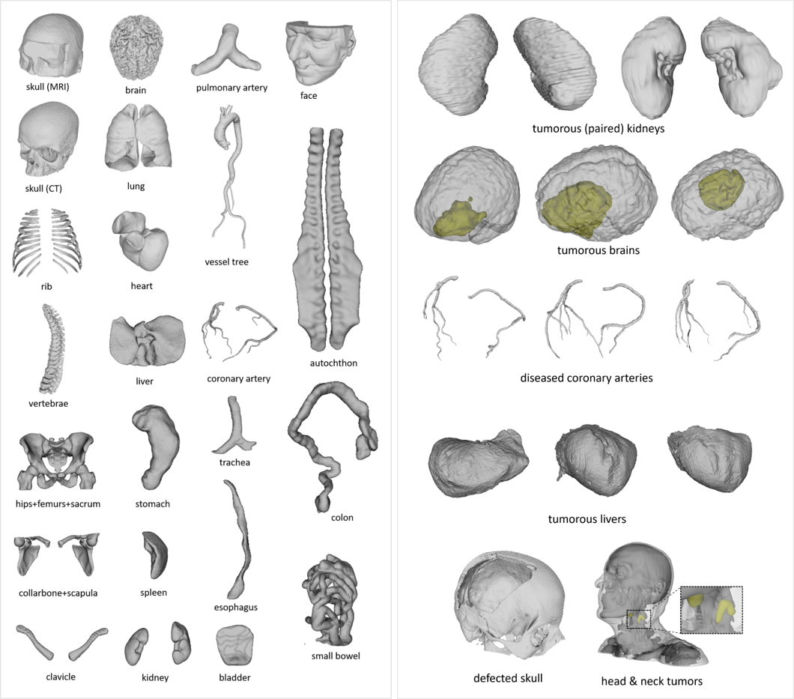

# MedShapeNet: <br> A Large-scale Dataset of 3D Medical Shapes
Prior to deep learning, shape was a primary descriptor in medical imaging. Modern state-of-the-art algorithms now use voxel grids, meshes, point clouds, and implicit surface models, as evidenced by the extensive use of ShapeNet and Princeton ModelNet. **MedShapeNet** is a comprehensive database of over 100,000 shapes related to medicine. It is accessible via a web interface. The models are developed from real patient imaging data, instruments and more. MedShapeNet is useful for various applications, including classification, reconstruction, extended reality and 3D printing.

**MedShapeNet 2.0** will focus on expanding the database, transforming the storage solution, enhance search functionality and referenceability. additionally the development and continuous improvements of a new Python API should facility easy integration of the database within Python applications. Thereafter we want to include labels beyond a name basis where possible to truly make it into a supporting tool for machine learning applications.

Subsequently, the future objective is to incorporate additional labels beyond those at an elementary level into MedShapeNet, with the objective of transforming it into a supporting instrument for machine learning applications made with Python.
Become a dataset contributor, help the shape driven community, and increase the visibility of your work.

**Direct links related to MSN**<br>
[💻 Main Project website](https://medshapenet.ikim.nrw/)<br>
[&#127760; MedShapeNet webinterface](https://medshapenet-ikim.streamlit.app/)<br>
[&#128196; MedShapeNet 1.0 arXiv Paper](https://arxiv.org/pdf/2308.16139)<br>
[🛠 MedShapeNet 🐍 Python-API](under construction)<br>
[📚 Papers/Projects citing MedShapeNet]()(*Under construction*)<br>
****
### content
[Overview](#medshapenet--a-large-scale-dataset-of-3d-medical-shapes)<br>
[Issues](#issues)<br>
[Contribute shapes](#contribute-shapes)<br>
[Python API](#python-api)<br>
[Related publications](#related-publications)<br>
[References](#references)<br>
[Contact](#contact)<br>

*Example of a few shapes available on MedShapeNet*


****
### Issues
- **Report issues with shapes, the website or the Python API:** Should you encounter any corrupted, incorrect, or unusable shapes, we kindly request that you report them to us. Alternatively, if you are the original data set owner, you may request the removal of specific shapes. [[issue](https://github.com/GLARKI/MedShapeNet2.0/issues)] *Please note that the API is currently under construction*
- **Contribute Shapes:** Contribute medical shapes extracted from your own datasets to the MedShapeNet Database by contacting me, see [contribute shapes](#contribute-shapes).
- **Showcase Applications** (*under construction*): Create a new folder in samples with the source code of your project. Describe the project and how to use it in a readme.md, including reference to your paper if possible. Perform a [pull request](https://github.com/GLARKI/MedShapeNet2.0/pulls
) let others enjoy! A basic example [here](https://github.com/glarki/medshapenet-feedback/tree/main/anatomy-completor) (*Under constuction for the API*).
- **Suggest Improvements:** Tell us the desired functions you want in the [MedShapeNet web interface](https://medshapenet-ikim.streamlit.app/) or API (*Under construction*) here [[issue](https://github.com/GLARKI/MedShapeNet2.0/issues)].
****
### Contribute shapes
Should you wish to contribute your own dataset to the MedShapeNet Database and API, you are invited to contact me via [LinkedIn](www.linkedin.com/in/gijsl) or to find my email address on the [XR-Lab's website](https://xrlab.ikim.nrw/). We cite the added database in subsequent publications and hope to increase its visibility via [our website](https://medshapenet-ikim.streamlit.app/) and Python API *under construction*.

Please provide the following information:
- A link to the dataset(s)
- A description of the dataset(s); *Publication(s), technical report(s), etc*
- Contributor(s) information: name, affiliation and homepage
- Other comments
****
### [Python API](https://pypi.org/project/MedShapeNetCore/) 
The Python API is under heavy construction.
Currently, in order to search and download shapes from the entire (Sciebo hosted) database, users must use the 'search_by_name' and 'search_and_download_by_name' methods either via Python or the Command Line interface.
All other methods are available only for the showcases - samples hosted on a MinIO S3 storage.
We are in the process of requiring large S3 storage from the [COSCINE](https://about.coscine.de/) project which will allow us to have up to 100TB multi redudant storage for at least 10 years!

```bash
pip install MedShapeNet
```
*Disclaimer: under heavy construction, full functionality and access to all datasets will come in the coming months*

If you desire to contribute by making examples or additional functionallity you are very welcome. Please [contact me](#contact) and perform a [pull request](https://github.com/GLARKI/MedShapeNet2.0/pulls).
****
### Related Publications
Publications we are aware of [using MedShapeNet](https://proj-page.github.io/medshapenet_publications.html) (*Under construction*)
List of papers that cite [MedShapeNet](https://scholar.google.com/scholar?cites=6282337273428834698&as_sdt=2005&sciodt=0,5&hl=en).

*Datasets contributed to MedShapeNet 1.0*
*please check the [&#128196; MedShapeNet 1.0 Paper](https://arxiv.org/pdf/2308.16139) for the corresponding references and source.*
| **Sources**  | **Description** | **Dataset License**  |
|--------------|-----------------|----------------------|
| **AbdomenAtlas**[41]          | 25 organs and seven types of tumor            |                   |
| **AbdomenCT-1K**[42]          | Abdomen organs                                | CC BY 4.0         |
| **AMOS**[43]                  | Abdominal multi-organs in CT and MRI          | CC BY 4.0         |
| **ASOCA**[44],[45]            | Normal and diseased coronary arteries         |                   |
| **autoPET**[46],[47],[48],[49]| Whole-body segmentations                      | CC BY 4.0         |
| **AVT**[50]                   | Aortic vessel trees                           | CC BY 4.0         |
| **BraTS**[51],[52],[53]       | Brain tumor segmentation                      |                   |
| **Calgary-campinas**[54]      | Brain structure segmentations                 |                   |
| **Crossmoda**[55],[56]        | Brain tumor and Cochlea segmentation          | CC BY 4.0         |
| **CT-ORG**[57]                | Multiple organ segmentation                   | CC 0 1.0          |
| **DigitalBodyPreservation**[58] | 3D scans of anatomical specimens            |                   |
| **EMIDEC**[59],[60]           | Normal and pathological (infarction) myocardium | CC BY-NC-SA 4.0 |
| **FacialModels**[61]          | Facial models for augmented reality           | CC BY 4.0         |
| **FLARE**[42],[62],[63],[64]  | 13 Abdomen organs                             |                   |
| **GLISRT**[65],[66],[67]      | Brain structures                              | TCIA Restricted   |
| **HCP**[68]                   | Paired brain-skull extracted from MRIs        | Data Use Terms    |
| **HECKTOR**[69],[70]          | Head and neck tumor segmentation              |                   |
| **ISLES22**[71]               | Ischemic stroke lesion segmentation           | CC BY 4.0         |
| **KiTS21**[72]                | Kidney and kidney tumor segmentation          | MIT               |
| **LiTS**[73]                  | Liver tumor segmentation                      |                   |
| **LNDb**[74],[75]             | Lung nodules                                  | CC BY-NC-ND 4.0   |
| **LUMIERE**[76]               | Longitudinal glioblastoma                     | CC BY-NC          |
| **MUG500+**[77]               | Healthy and craniotomy CT skulls              | CC BY 4.0         |
| **MRIGBM**[78]                | Brain and GBM extracted from MRIs             | CC BY 4.0         |
| **PROMISE**[79]               | Prostate MRI segmentation                     |                   |
| **PulmonaryTree**[80]         | Pulmonary airways, arteries and veins         | CC BY 4.0         |
| **SkullBreak**[81]            | Complete and artificially defected skulls     | CC BY 4.0         |
| **SkullFix**[81]              | Complete and artificially defected skulls     | CC BY 4.0         |
| **SUDMEXCONN**[82]            | Healthy and (cocaine use disorder) CUD brains | CC 0              |
| **TCGA-GBM**[53]              | Glioblastoma                                  |                   |
| **3D-COSI**[83]               | 3D medical instrument models                  | CC BY 4.0         |
| **3DTeethSeg**[84],[85]       | 3D Teeth Scan Segmentation                    | CC BY-NC-ND 4.0   |
| **ToothFairy**[86],[87]       | Inferior alveolar canal                       | CC BY-SA          |
| **TotalSegmentator**[88]      | Various anatomical structures                 | CC BY 4.0         |
| **VerSe**[89]                 | Large scale vertebrae segmentation            | CC BY 4.0         |
****
### References
If you use MedShapeNet in your research or project please cite MedShapeNet as:
```
@article{li2023medshapenet,
  title={MedShapeNet--A Large-Scale Dataset of 3D Medical Shapes for Computer Vision},
  author={Li, Jianning and Pepe, Antonio and Gsaxner, Christina and Luijten, Gijs and Jin, Yuan and Ambigapathy, Narmada and Nasca, Enrico and Solak, Naida and Melito, Gian Marco and Memon, Afaque R and others},
  journal={arXiv preprint arXiv:2308.16139},
  year={2023}
}
```
****
### Contact
Contact [Gijs Luijten](mailto:gijs.luijten@uk-essen.de) or [LinkedIn](www.linkedin.com/in/gijsl) any questions related to MedShapeNet.
****